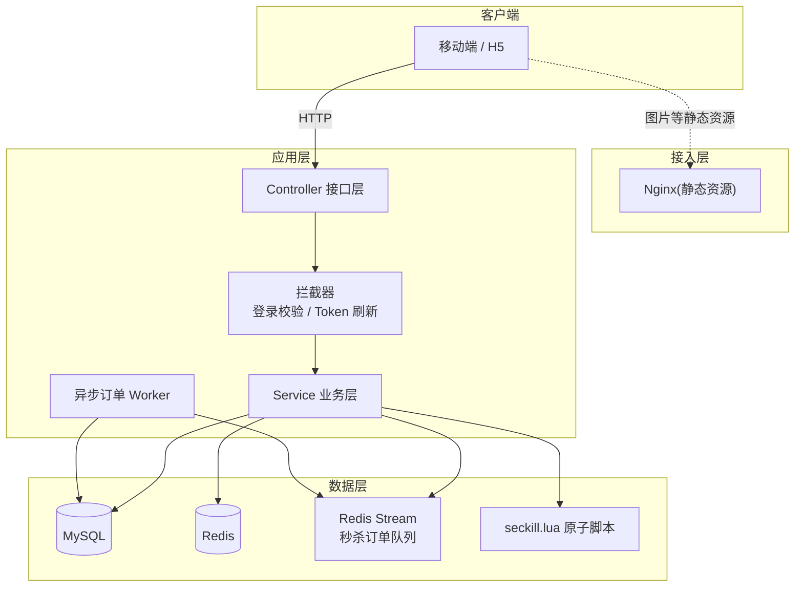
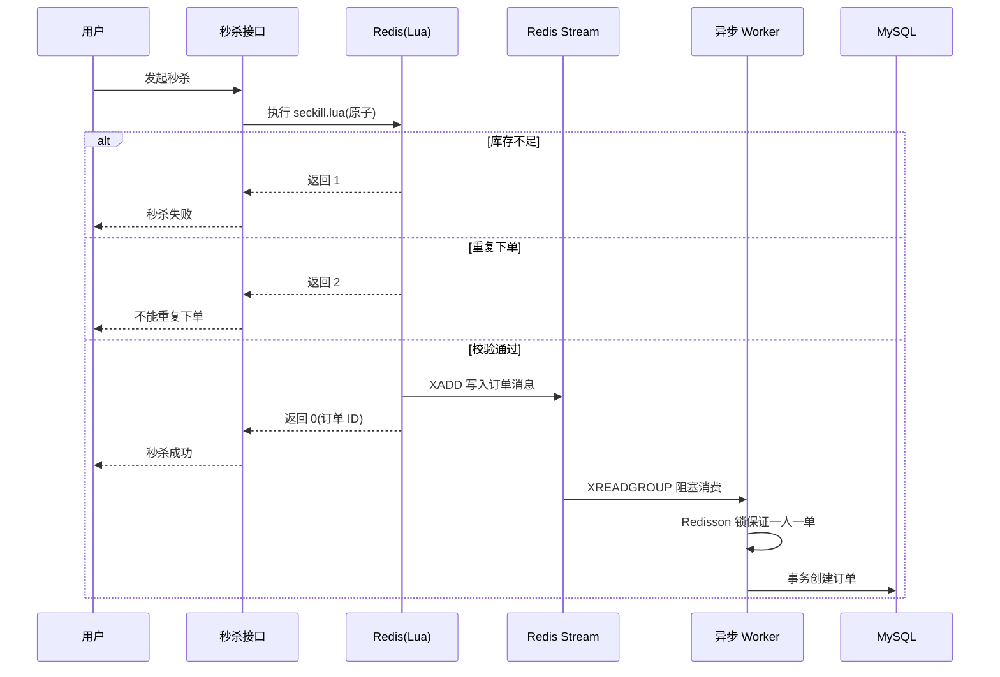

<div align="center">

# 🏋️ 跃动空间 · Active Space

### 专为同城健身爱好者打造的综合服务平台

**场馆 / 私教检索 · 稀缺器械 & 体验课预约 · 健身动态分享**

后端独立开发 · Spring Boot + Redis 高并发实践项目


</div>

---

## 📖 目录

- [项目定位](#-项目定位)
- [核心功能](#-核心功能)
- [系统架构](#-系统架构)
- [技术亮点](#-技术亮点)
  - [亮点一:缓存三兄弟的工程化防御](#-亮点一缓存三兄弟的工程化防御)
  - [亮点二:Redis + Lua 原子秒杀与异步下单](#-亮点二redis--lua-原子秒杀与异步下单)
  - [亮点三:用 Redis 数据结构驱动业务](#-亮点三用-redis-数据结构驱动业务)
- [Redis Key 设计](#-redis-key-设计)
- [性能表现](#-性能表现)
- [快速开始](#-快速开始)
- [项目结构](#-项目结构)

---

## 🎯 项目定位

面向同城健身人群的一站式服务平台，覆盖从**找场馆/私教**、**预约稀缺器械与体验课**，到**分享健身动态、建立同好社交关系**的完整链路。

- **业务侧**:场馆与私教检索、秒杀式预约、动态/笔记、关注与 Feed 流
- **技术侧**:以 Redis 为核心的高并发、缓存一致性、分布式锁、异步化实践

---

## 🧩 核心功能

| 模块 | 功能说明 | 关键实现 |
| --- | --- | --- |
| 👤 用户体系 | 手机验证码登录、会话管理 | 双拦截器 **Token 自动刷新**、Redis 会话 |
| 📍 场馆/私教检索 | 分类浏览、**附近 5km 检索** | Redis **GEO**、`GEOSEARCH` 距离排序 |
| 🎟️ 器械/体验课预约 | 秒杀抢购、**一人一单** | Lua 原子扣减 + **Redis Stream 异步下单** |
| 📝 动态分享 | 发布动态、点赞、**点赞排行榜** | **ZSet** 按时间戳排序 |
| 👥 关注关系 | 关注/取关、共同关注 | **Set** 交集 `SINTER` |
| 📥 好友 Feed 流 | 关注者动态推送 | **推模式** 收件箱 + **滚动分页** |

---

## 🏛️ 系统架构



**核心思想**:主链路请求只做「预校验 + 排队」，重活(订单落库)全部异步化，由独立的 Worker 消费 Redis Stream，最大化接口吞吐。

---

## ⚡ 技术亮点

### 💡 亮点一:缓存三兄弟的工程化防御

针对查询热点(场馆/教练主页)，系统性地解决缓存三大经典问题:

| 问题 | 方案 | 实现要点 | 代码位置 |
| --- | --- | --- | --- |
| **缓存穿透** | 缓存空值 | 查无数据时写入空值(2min TTL)，拦截对不存在 Key 的重复打库 | [ShopServiceImpl](src/main/java/com/activespace/service/impl/ShopServiceImpl.java#L77) |
| **缓存击穿** | 互斥锁 + **双重检查** | `SETNX` 抢锁，抢到后**二次读缓存**再回源 DB，重建完释放 | [CacheClient](src/main/java/com/activespace/utils/CacheClient.java#L127) |
| **缓存击穿** | 逻辑过期 + **异步重建** | 热点数据不物理过期，过期后**单线程池异步重建**，请求先返回旧数据 | [CacheClient](src/main/java/com/activespace/utils/CacheClient.java#L75) |
| **缓存雪崩** | 差异化 TTL | 不同业务配置不同过期时间，避免同时失效 | [RedisConstants](src/main/java/com/activespace/utils/RedisConstants.java) |

> 💡 **逻辑过期为何更优**:互斥锁方案在重建瞬间仍会阻塞请求；逻辑过期方案让**所有请求都立即返回旧数据**，重建在独立线程池中完成，用户几乎无感知。这是典型的「冷热数据隔离」——热点数据常驻缓存，用「逻辑时间」代替「物理过期」。

```java
// 逻辑过期重建：拿到锁的线程异步刷新缓存，其余请求直接返回过期数据
CACHE_REBUILD_EXECUTOR.submit(() -> {
    R newR = dbFallback.apply(id);      // 回源数据库
    this.setWithLogicalExpire(key, newR, time, unit); // 重建缓存
});
```

### 💡 亮点二:Redis + Lua 原子秒杀与异步下单

**痛点**:秒杀是典型的超卖重灾区，且「校验库存 + 校验重复 + 扣减 + 记录」必须原子完成。

**方案一 · Lua 脚本保证原子性** —— 一个脚本内完成全部校验与扣减，杜绝并发超卖:

```lua
-- 1. 库存不足 → 返回 1
if tonumber(redis.call('get', stockKey)) <= 0 then return 1 end
-- 2. 重复下单 → 返回 2
if redis.call('sismember', orderKey, userId) == 1 then return 2 end
-- 3. 原子扣减库存、记录用户
redis.call('incrby', stockKey, -1)
redis.call('sadd', orderKey, userId)
-- 4. 写入异步订单队列
redis.call('xadd', 'stream.orders', '*', 'userId', userId, 'voucherId', voucherId, 'id', orderId)
return 0
```
*脚本见 [seckill.lua](src/main/resources/seckill.lua)*

**方案二 · Redis Stream 异步下单** —— 接口层执行 Lua 后**立即返回订单 ID**，真正的订单落库交给消费者异步完成:



**方案三 · Redisson 分布式锁兜底** —— 异步 Worker 中按用户粒度加锁，解决**集群环境下 JVM 锁失效**的问题，同时配合数据库 `stock > 0` 条件更新做最终兜底。

> 📈 **压测结果**:JMeter 并发压测下单机峰值 **QPS 600+**，库存 **0 超卖**，重复下单全部被拦截。

### 💡 亮点三:用 Redis 数据结构驱动业务

| 业务场景 | 数据结构 | 实现思路 | 代码位置 |
| --- | --- | --- | --- |
| 附近商户检索 | **GEO** | 商家按 `typeId` 分组存入 GEO，`GEOSEARCH BYLONLAT 5000` 按距离排序并带 `distance` | [ShopController](src/main/java/com/activespace/controller/ShopController.java) |
| 点赞 & 排行榜 | **ZSet** | `score = 点赞时间戳`，`ZREVRANGE` 取 Top5 点赞用户 | [BlogServiceImpl](src/main/java/com/activespace/service/impl/BlogServiceImpl.java#L123) |
| 关注 Feed 流 | **ZSet** | 发布动态时**推送给所有粉丝**的收件箱，`score = 毫秒时间戳` 保证时序 | [BlogServiceImpl](src/main/java/com/activespace/service/impl/BlogServiceImpl.java#L59) |
| 关注关系 | **Set** | 关注列表，共同关注用 `SINTER` 交集一次算出 | [FollowServiceImpl](src/main/java/com/activespace/service/impl/FollowServiceImpl.java#L89) |
| 全局唯一 ID | **String 自增** | `时间戳(31bit) << 32 | 按天自增序列号`，支持 2^32 单机/天，不依赖数据库主键 | [RedisIdWorker](src/main/java/com/activespace/utils/RedisIdWorker.java) |

> 💡 **Feed 流滚动分页的细节**:不同于 MySQL 的 limit 分页，ZSet 分页通过 `ZREVRANGEBYSCORE` 返回 `minTime + offset`，**精确处理同分数据的偏移**，避免点赞/发布导致重复或漏读。

---

## 🗃️ Redis Key 设计

| Key | 类型 | 说明 | 过期策略 |
| --- | --- | --- | --- |
| `login:code:{phone}` | String | 登录验证码 | 2 min |
| `login:token:{token}` | String | 用户会话 | 30 min(访问自动续期) |
| `cache:shop:{id}` | String(JSON) | 场馆缓存(逻辑过期) | 逻辑 20s |
| `lock:shop:{id}` | String | 场馆重建互斥锁 | 10s |
| `seckill:stock:{vid}` | String | 秒杀库存 | 随活动 |
| `seckill:order:{vid}` | Set | 已下单用户 | 随活动 |
| `stream.orders` | Stream | 秒杀订单消息队列 | 持久 |
| `blog:liked:{id}` | ZSet | 点赞用户(按时间) | 持久 |
| `feed:{userId}` | ZSet | 粉丝动态收件箱 | 持久 |
| `shop:geo:{typeId}` | GEO | 商户地理位置 | 持久 |
| `follows:{userId}` | Set | 关注列表 | 持久 |
| `icr:{prefix}:{date}` | String | 分布式 ID 序列号 | 按天 |

---

## 📊 性能表现

| 指标 | 优化前 | 优化后 |
| --- | --- | --- |
| 核心查询接口响应 | ~800ms | **< 150ms** |
| 缓存命中率 | — | **90%+** |
| 秒杀下单单机峰值 | — | **QPS 600+** |
| 秒杀超卖 | — | **0 超卖** |

> 数据来源:JMeter 压测 + 接口实测。

---

## 🚀 快速开始

1. **初始化数据库**:执行 [active_space.sql](src/main/resources/db/active_space.sql)，创建 `active_space` 库
2. **修改配置**:在 [application.yaml](src/main/resources/application.yaml) 中配置 MySQL、Redis 连接，并将 [SystemConstants](src/main/java/com/activespace/utils/SystemConstants.java) 中的 `IMAGE_UPLOAD_DIR` 指向你的静态资源目录
3. **启动项目**

```bash
mvn spring-boot:run
```

主类:`com.activespace.ActiveSpaceApplication`，默认端口 `8081`。

---

## 📁 项目结构

```
src/main/java/com/activespace
├── config        # 拦截器注册、Redisson、MyBatis-Plus 配置
├── controller    # 接口层
├── dto           # 数据传输对象
├── entity        # 实体
├── interceptor   # 登录校验、Token 刷新拦截器
├── mapper        # MyBatis-Plus Mapper
├── service       # 业务接口与实现
└── utils         # CacheClient、RedisIdWorker、Redis 常量等

src/main/resources
├── db/active_space.sql   # 数据库初始化脚本
├── mapper/VoucherMapper.xml
├── seckill.lua           # 秒杀原子脚本
└── application.yaml
```

---

<div align="center">

**跃动空间 · Active Space** — 学习交流项目，仅用于个人简历与技术展示

</div>
